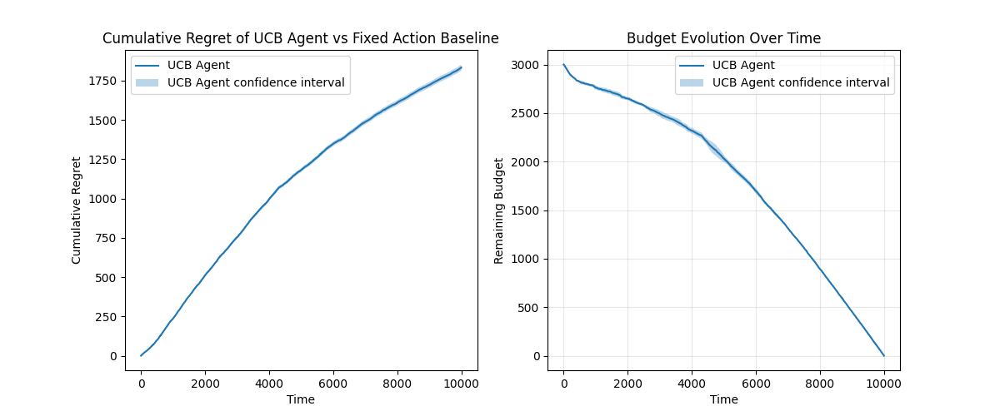
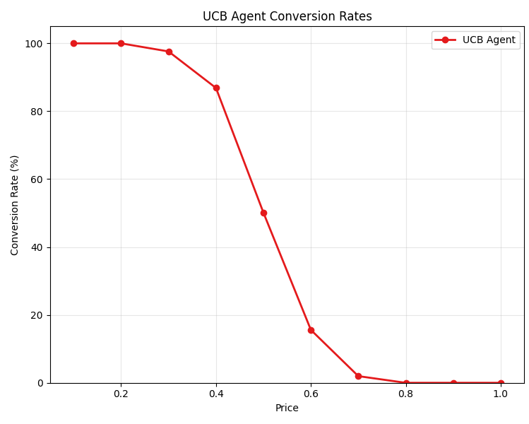
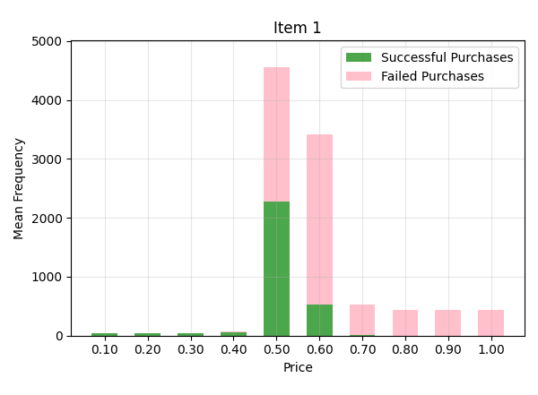
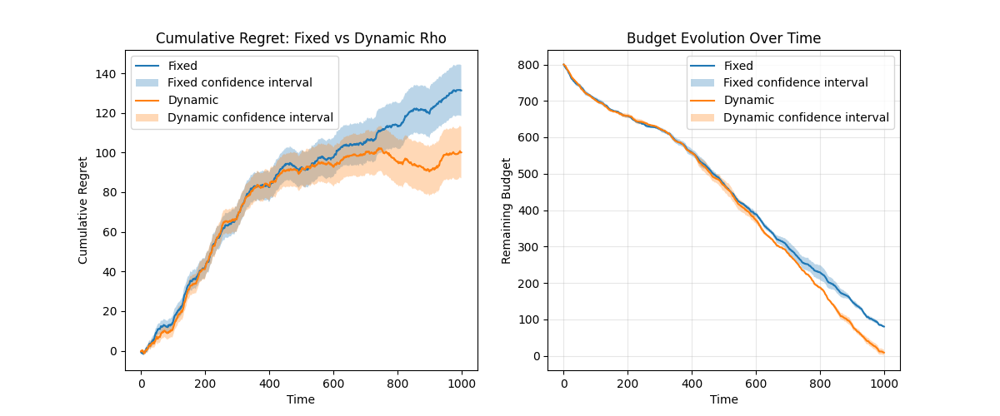
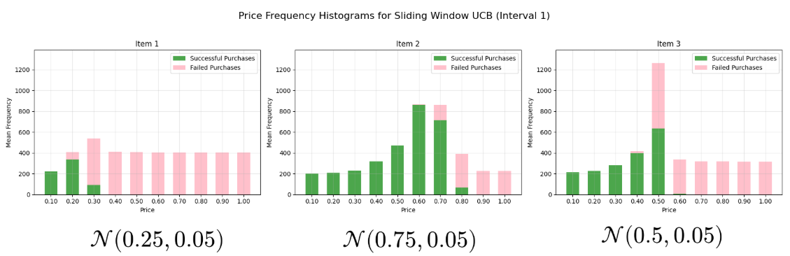
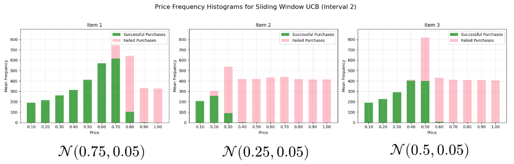
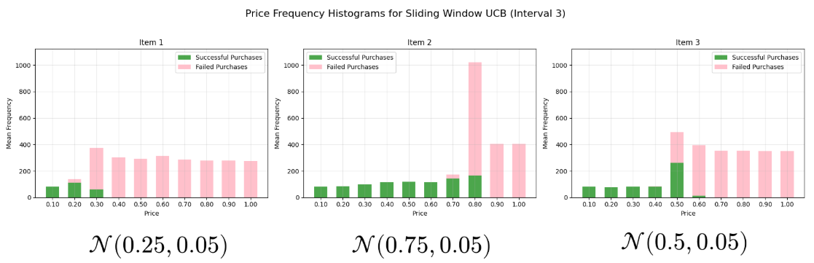

# Multi-Armed-Pirate

This repository contains the implementation of the project assigned for the course "Online Learning Applications" from Politecnico di Milano in the academic year 2024/2025. The requirements and project description can be found in the [project requirements](project_requirements.pdf) file.


The name "Multi-Armed-Pirate" is inspired by the classic "Multi-Armed Bandit" problem, even though this project focuses on the **dynamic pricing problem** with **multiple products** and **budget constraints**.

Authors: Ceccarelli Valerio, De Vito Alessio, Fiocchi Edoardo.

## Overview of the Project

Below is a brief overview of the main topics addressed in the project. For a more detailed walkthrough, see the accompanying slides: [Google Presentation](https://docs.google.com/presentation/d/17VjTtiA57XB81jg1mF-1R7BiMcao8M-G12Y5fvGkirU/edit?usp=sharing) (Italian).

### Problem setting

- Dynamic pricing with unknown conversion rates.
- Multiple products and a global budget constraint on the number of discounted interactions/sales.
- Objective: maximize cumulative revenue while respecting the budget over a fixed time horizon.

### Single Product and Stochastic Environments



For requirement 1, we modified the classic UCB algorithm to handle budget constraints, drawing inspiration from bidding algorithms used in online auctions. As shown in the figure, the agent achieves sublinear regret and exhausts the budget precisely at the end of the time horizon.

<p align="center">
	
	
</p>

The agent learns the demand curve over time (generated by a Gaussian environment) and focuses its pulls on prices equal or bigger than the optimal one (0.5 in this case), which yield the highest revenue while avoiding budget waste on low‑revenue prices.


### Multiple Products and Highly Non-Stationary Environments



In requirement 4, we tackle the problem of multiple products in highly non-stationary environments using a primal-dual algorithm. The figure compares performance with a fixed rho (the dual variable associated with the budget constraint) versus a dynamic rho that is updated over time based on the remaining budget and time. Both agents achieve sublinear regret, but the dynamic-rho agent fully consumes the budget and therefore attains lower regret.

### Sliding Window for Slightly Non-Stationary Environments

Requirement 5 focuses on slightly non-stationary environments. We implement a sliding-window UCB algorithm that considers only the most recent observations to adapt to changes in the environment. The figures below show how the agent adapts to abrupt changes in the demand curve. We study 3 items and 3 abrupt changes: while the third item remains unchanged, the first two items swap their demand curves.





The agent adapts to these changes and concentrates its pulls on the optimal prices for each item.

## Documentation

### Requirements
The project is tested with Python 3.10. You can find the required packages in the `requirements.txt` file. To install them, you can use pip:

```bash
pip install -r requirements.txt
```

### Usage
In the `src` folder, you can find the main scripts to run the project. For example, to run the requirement 1, you can execute:

```bash
cd src
python req1.py
```

Outputs (figures and GIFs) are saved under `results/reqX/`.

### Structure
The project is organized as follows:

- `src/`: Entry points for each requirement (`req1.py` … `req5.py`) and utilities.
- `results/`: Experiment outputs (plots, GIFs, etc.), grouped by requirement.
- `src/core/`: Core implementations:
	- `agents.py`: Learning agents (UCB variants, combinatorial, primal–dual, sliding window).
	- `baselines.py`: Baseline strategies used for comparison.
	- `environments.py`: Simulated environment and demand/conversion models.
	- `plotting.py`: Plot/animation utilities for results.
	- `runner.py`: Experiment orchestration (loops, logging, saving).
